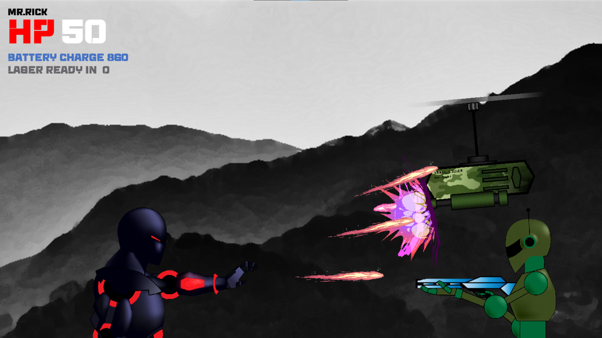
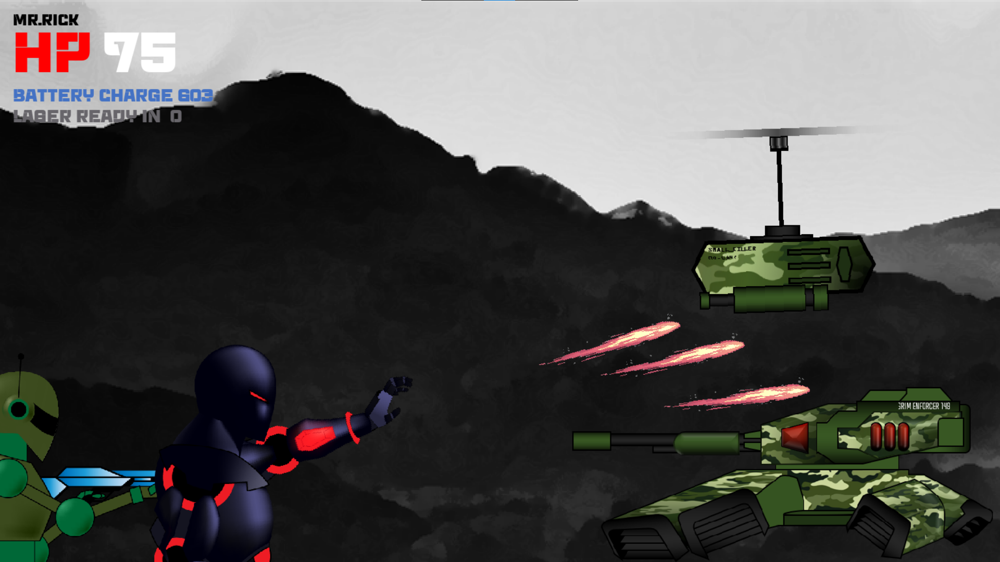

# Bad Robots – Demo Version 🔫🤖

**Bad Robots** is a 2D sci-fi action platformer set in a dark, post-human warzone.  
Built with Python & Pygame, this demo introduces players to Rick — a robotic warrior with a forgotten past.

> ⚠️ This is a **DEMO build**: Story and world lore are not implemented yet.

---

## 🎮 Features in this Demo

- 🔫 Playable character: **Rick** with laser attacks
- 🤖 Enemies: drones, tanks, and foot soldiers
- 🎚️ Difficulty selection menu *(non-functional for now)*
- ⏹️ Stage 1 only – no end trigger yet
- 🛑 Exit game with `ESC`

---

## 🖥️ Screenshots

---

## 🚧 Development Status

This is a solo dev project, currently in demo phase.  
Further development will include:

- Multiple stages
- Story & cutscenes
- Enemy AI upgrades
- Boss fights
- Music & sound effects

---

## 📜 The World (Coming Soon...)

In a future where humans created emotionally-aware machines, wars are no longer fought by people — only by **Bad Robots**.  
A grand narrative is being developed featuring betrayal, legacy, and lost identity.

---

## 🛠️ Run Instructions

1. Download `badrobots_demo.exe` from [Releases](#)
2. Run the executable
3. Press `Start` > Select any difficulty
4. Use arrow keys and fire to destroy enemies
5. Press `ESC` to exit the game

---

## 👤 Developer

Made with passion by **آریا**

---

## 📄 License

This build is **closed-source**. All rights reserved ©
